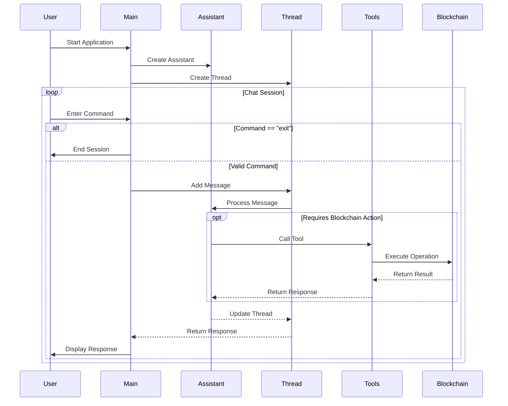

# LineAI

## Description

**LineAI** is a powerful tool designed to interact with [Linea](https://linea.build/) network following the principles of the [PostWeb by Outlier Ventures](http://postweb.io/). It leverages OpenAI's GPT-4o-mini model to provide a conversational interface for users to perform various blockchain operations, such as checking wallet balances, sending transactions, and deploying smart contracts.

## Features

- **Conversational Interface**: Engage with the assistant to perform blockchain operations through natural language.
- **Wallet Operations**: Check wallet balances and retrieve connected wallet addresses.
- **Transaction Management**: Send transactions with customizable parameters.
- **Smart Contract Interaction**: Deploy ERC20 tokens and interact with existing contracts.
- **Error Handling**: Robust error handling and feedback for failed operations.

## Getting Started

### Prerequisites

- Node.js (version 14 or higher)
- TypeScript
- OpenAI API key
- Environment variables for wallet private key and other configurations

### Installation

1. Clone the repository:

   ```bash
   git clone https://github.com/techgethr/aineum.git
   cd aineum
   ```

2. Install dependencies:

   ```bash
   bun install (or npm install)
   ```

3. Set up environment variables:
   Create a `.env` file in the root directory and add your OpenAI API key and wallet private key:
   ```plaintext
   OPENAI_API_KEY=your_openai_api_key
   WALLET_PRIVATE_KEY=your_wallet_private_key
   ASSISTANT_NAME=A_name_assistant_to_register_in_openai
   ```

**The HTTP endpoint can be associated with mainnet or testnet, the framework will take those values ​​to act on the corresponding network.**

### Usage

To start the assistant, run:

```bash
bun run src/index.ts
```

You can then interact with the assistant in the command line. Type "exit" to end the conversation.

### Tools

The assistant has access to various tools for performing blockchain operations:

#### Read Operations
- **get_balance**: Check wallet balances on the Linea network
- **get_wallet_address**: Retrieve the connected wallet's address
- **get_token_balances**: Retrieve the token balances in a Linea wallet.
- **get_token_prices**: Retrieve the value (in USDC) for any Linea token (including ETH).


#### Write Operations
- **send_transaction**: Send transactions with customizable parameters including:
  - Transaction value in ETH
  - Custom data for contract interactions
  - Gas price settings
  - EIP-2930 access lists
  - Factory dependencies
  - Paymaster configurations
- **deploy_erc20**: Deploy new ERC20 token contracts with:
  - Customizable token name and symbol
  - Configurable initial supply
  - Standard ERC20 functionality

## How to extend

1. Create a new tool in the _tools_ folder.
2. Add the function in the tool.
3. Register the tool in [allTools](./tools/allTools.ts)
4. Update the prompt (**in the prompt file inside the constants folder**) for the assistant to understand when it must run the tool.

## Codebase Flow

The following sequence diagram illustrates the core flow of the application:



### Diagram Explanation

The sequence diagram above shows the interaction flow between different components:

1. **Initialization**:
   - Application starts with creating an OpenAI Assistant
   - A new Thread is created for the conversation

2. **Chat Session Loop**:
   - User enters commands through the CLI
   - Commands are processed through the Thread and Assistant
   - For blockchain operations, specific Tools are called
   - Results are returned through the chain of components

3. **Blockchain Integration**:
   - Tools interface with the blockchain through Viem clients
   - Operations are executed on the Linea network
   - Results are propagated back to the user

4. **Session Management**:
   - Users can exit the application at any time
   - Each command is processed in a sequential manner
   - Responses are displayed back to the user

## Contributing

Contributions are welcome! Please open an issue or submit a pull request for any enhancements or bug fixes.

## License

This project is licensed under the MIT License. See the [LICENSE](LICENSE) file for details.

## Acknowledgments

- OpenAI for providing the GPT-4o-mini model.
- Viem for blockchain interaction utilities.

## Contact

https://x.com/nes_campos 
